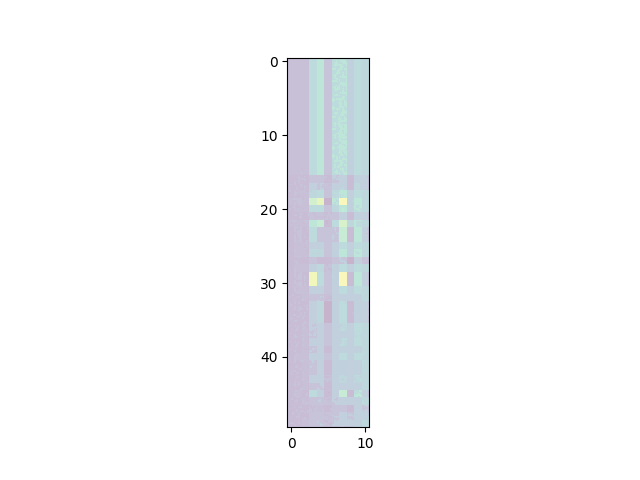

# Coreax
_© Crown Copyright GCHQ_

Coreax is a library for coreset algorithms, written in [Jax](https://jax.readthedocs.io/en/latest/notebooks/quickstart.html) for fast execution and GPU support. A coreset algorithm takes a _n_ by _d_ data set and reduces it to _m_ << _n_ points whilst attempting to preserve the statistical properties of the full data set. The algorithms typically return the _m_ points with weights, such that importance can be attributed to each point. Some algorithms choose a weights' set from the simplex, i.e. such that they are non-negative and sum to 1.

*Choosing 20% of the points. (Centre) 8000 coreset points using Stein kernel herding, with point size a function of weight. (Right) 8000 points chosen randomly.*


*Video event detection: identifying representative frames such that most of the useful information in a video is preserved*


*Filesystem reduction: identifying files and directories that best preserve the structure at a much-reduced storage cost*





## Quick example
Here are _n_=10,000 points drawn from 6 2_d_ Gaussians. Coreset size is _m_=100.

 

## Setup 
1. Install [Jax](https://jax.readthedocs.io/en/latest/notebooks/quickstart.html), noting that there are (currently) different setup paths for CPU and GPU use.

2. Install coreax from this directory `pip install .`

## Commonly used functions
Here are some of the most commonly used functions in the library.

### Kernel herding
Basic kernel herding can be invoked using `kernel_herding_block` from `coreax.kernel_herding`:

```python
from coreax.kernel_herding import kernel_herding_block
from coreax.kernel import rbf_kernel, median_heuristic
from coreax.weights import qp
from coreax.metrics import mmd_weight_block

from sklearn.datasets import make_blobs
import jax.numpy as jnp
import numpy as np

# create some data
n = 10000
m = 100
d = 2
X, _ = make_blobs(n, n_features=d, centers=6, random_state=32)

# choose the base kernel bandwidth using a median heuristic
N = min(X.shape[0], 1000)
idx = np.random.choice(X.shape[0], N, replace=False)
nu = median_heuristic(X[idx])

# define a kernel
k = lambda x, y : rbf_kernel(x, y, jnp.float32(nu)**2)/(nu * jnp.sqrt(2. * jnp.pi))

# get a coreset and some weights
coreset, Kc, Kbar = kernel_herding_block(X, m, k)
weights = qp(Kc + 1e-10, Kbar)

# assess performance using MMD
mmd = mmd_weight_block(X, X[coreset], jnp.ones(n), weights, k)
print("MMD: %.6f" % mmd)
```

### Kernel herding with refine
A refine step can be added to kernel herding to improve performance. See the functions in `coreax.kernel_herding_refine`, e.g. replacing the `kernel_herding_block` function above with
```python
from coreax.kernel_herding_refine import kernel_herding_refine_block
coreset = kernel_herding_refine_block(X, m, k):
```

### Stein kernel herding
Herding using a Stein kernel. To use this, we have to define a continuous approximation to the discerete measure, e.g. using a KDE. Here, we use a Stein kernel with an inverse multi-quadric base kernel:
```python
from coreax.kernel import stein_kernel_pc_imq_element, rbf_grad_log_f_X
from coreax.kernel_herding import stein_kernel_herding_block

coreset, Kc, Kbar = stein_kernel_herding_block(X, m, stein_kernel_pc_imq_element, rbf_grad_log_f_X, nu=nu)
```

### Scalable herding
For large _n_ or _d_, you may run into time or memory issues. `scalable_herding` in `coreax.kernel_herding` uses partitioning to tractably compute an approximate coreset in reasonable time. There is a necessary impact on coreset quality, but we get dramatic improvement in computation.

For some idea of performance, `scalable_herding` on a `ml.p3.8xlarge` gives the following (post-JIT) timings for 2D data with an RBF kernel.
```
|n   | Time |
|----|------|
|10^5|5s    |
|10^6|40s   |
|10^7|7m35s |
|10^8|1hr7m |
```

## More examples
More example notebooks and code files can be found in `./examples`.
