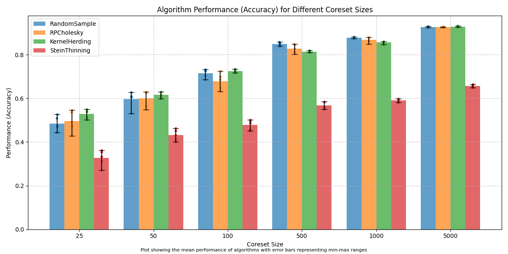

Benchmarking Coreset Algorithms
===============================

In this benchmark, we assess the performance of different coreset algorithms:
:class:`~coreax.solvers.KernelHerding`, :class:`~coreax.solvers.SteinThinning`,
:class:`~coreax.solvers.RandomSample`, :class:`~coreax.solvers.RPCholesky`,
:class:`~coreax.solvers.KernelThinning`, and :class:`~coreax.solvers.CompressPlusPlus`.
Each of these algorithms is evaluated
across four different tests, providing a comparison of their performance and
applicability to various datasets.

Test 1: Benchmarking Coreset Algorithms on the MNIST Dataset
------------------------------------------------------------

The first test evaluates the performance of the coreset algorithms on the
**MNIST dataset** using a simple neural network classifier. The process follows
these steps:

1. **Dataset**: The MNIST dataset consists of 60,000 training images and 10,000
   test images. Each image is a 28x28 pixel grey-scale image of a handwritten digit.

2. **Model**: A Multi-Layer Perceptron (MLP) neural network is used for
   classification. The model consists of a single hidden layer with 64 nodes.
   Images are flattened into vectors for input.

3. **Dimensionality Reduction**: To speed up computation and reduce dimensionality, a
   density preserving :class:`~umap.umap_.UMAP` is applied to project the 28x28 images
   into 16 components before applying any coreset algorithm.

4. **Coreset Generation**: Coresets of various sizes are generated using the
   different coreset algorithms. For :class:`~coreax.solvers.KernelHerding`,
   :class:`~coreax.solvers.SteinThinning`, and :class:`~coreax.solvers.KernelThinning`,
   :class:`~coreax.solvers.MapReduce` is employed to handle large-scale data.

5. **Training**: The model is trained using the selected coresets, and accuracy is
   measured on the test set of 10,000 images.

6. **Evaluation**: Due to randomness in the coreset algorithms and training process,
   the experiment is repeated 4 times with different random seeds. The benchmark is run
   on an **Amazon Web Services EC2 g4dn.12xlarge instance** with 4 NVIDIA T4 Tensor Core
   GPUs, 48 vCPUs, and 192 GiB memory.

Impact of UMAP and MapReduce on Coreset Performance
---------------------------------------------------

In the benchmarking of coreset algorithms, only **Random Sample** can be run without
MapReduce or UMAP without running into memory allocation errors. The other coreset
algorithms require dimensionality reduction and distributed processing to handle
large-scale data efficiently. As a result, the coreset algorithms were not applied
directly to the raw MNIST images. While these preprocessing steps improved efficiency,
they may have impacted the performance of the coreset methods. Specifically,
**MapReduce** partitions the dataset into subsets and applies solvers to each partition,
which can reduce accuracy compared to applying solvers directly to the full dataset.
Additionally, **batch normalisation** and **dropout** were used during training to
mitigate over-fitting. These regularisation techniques made the models more robust,
which also means that accuracy did not heavily depend on the specific subset chosen.
The benchmarking test showed that the accuracy remained similar regardless of
the coreset method used, with only small differences, which could potentially be
attributed to the use of these regularisation techniques.

**Results**:
The accuracy of the MLP classifier when trained using the full MNIST dataset
(60,000 training images) was 97.31%, serving as a baseline for evaluating the
performance of the coreset algorithms.

**Figure 1**: Accuracy of coreset algorithms on the MNIST dataset. Bar heights
represent the average accuracy. Error bars represent the min-max range for accuracy
for each coreset size across 5 runs.

.. image:: ../../examples/benchmarking_images/mnist_benchmark_time_taken.png
 :alt: Time Taken Benchmark Results for MNIST Coreset Algorithms

**Figure 2**: Time taken to generate coreset for each coreset algorithm. Bar heights
represent the average time taken. Error bars represent the min-max range for each
coreset size across 5 runs.

Test 2: Benchmarking Coreset Algorithms on a Synthetic Dataset
--------------------------------------------------------------

In this second test, we evaluate the performance of the coreset algorithms on a
**synthetic dataset**. The dataset consists of 1,024 points in two-dimensional space,
generated using :func:`sklearn.datasets.make_blobs`. The process follows these steps:

1. **Dataset**: A synthetic dataset of 1,024 points is generated to test the
   quality of coreset algorithms.

2. **Coreset Generation**: Coresets of different sizes (10, 50, 100, and 200 points)
   are generated using each coreset algorithm.

3. **Evaluation Metrics**: Two metrics evaluate the quality of the generated coresets:
   :class:`~coreax.metrics.MMD` and :class:`~coreax.metrics.KSD`.

4. **Optimisation**: We optimise the weights for coresets to minimise the MMD score
   and recompute both MMD and KSD metrics. These entire process is repeated 5 times with
   a different random seed each time and the metrics are averaged.

**Results**:
The tables below show the performance metrics (Unweighted MMD, Unweighted KSD,
Weighted MMD, Weighted KSD, and Time) for each coreset algorithm and each coreset size.
For each metric and coreset size, the best performance score is highlighted in bold.

.. list-table:: Coreset Size 25 (Original Sample Size 1,024)
   :header-rows: 1
   :widths: 20 15 15 15 15 15

   * - Method
     - Unweighted_MMD
     - Unweighted_KSD
     - Weighted_MMD
     - Weighted_KSD
     - Time
   * - KernelHerding
     - 0.024273
     - 0.072547
     - 0.008471
     - 0.072267
     - 4.600567

   * - RandomSample
     - 0.111424
     - 0.077308
     - 0.011224
     - 0.073833
     - **3.495483**

   * - RPCholesky
     - 0.140047
     - **0.059306**
     - 0.003688
     - **0.071969**
     - 4.230014

   * - SteinThinning
     - 0.147962
     - 0.075813
     - 0.017571
     - 0.074239
     - 4.806702

   * - KernelThinning
     - 0.014880
     - 0.072271
     - 0.005388
     - 0.072463
     - 27.173368

   * - CompressPlusPlus
     - 0.013212
     - 0.072479
     - 0.007081
     - 0.072777
     - 17.304506

   * - ProbabilisticIterativeHerding
     - 0.021128
     - 0.073220
     - 0.007852
     - 0.073069
     - 4.669493

   * - IterativeHerding
     - 0.007051
     - 0.072036
     - 0.005125
     - 0.072206
     - 4.062584

   * - CubicProbIterativeHerding
     - **0.004543**
     - 0.072165
     - **0.003512**
     - 0.072366
     - 4.687458

.. list-table:: Coreset Size 50 (Original Sample Size 1,024)
   :header-rows: 1
   :widths: 20 15 15 15 15 15

   * - Method
     - Unweighted_MMD
     - Unweighted_KSD
     - Weighted_MMD
     - Weighted_KSD
     - Time
   * - KernelHerding
     - 0.014011
     - 0.072273
     - 0.003191
     - **0.072094**
     - 4.139396

   * - RandomSample
     - 0.104925
     - 0.078755
     - 0.004955
     - 0.072600
     - **3.580714**

   * - RPCholesky
     - 0.146650
     - **0.056694**
     - 0.001539
     - 0.072209
     - 3.820043

   * - SteinThinning
     - 0.132586
     - 0.077087
     - 0.006761
     - 0.072635
     - 4.231215

   * - KernelThinning
     - 0.006304
     - 0.072012
     - 0.002246
     - 0.072222
     - 15.216022

   * - CompressPlusPlus
     - 0.007616
     - 0.072154
     - 0.002819
     - 0.072249
     - 11.209934

   * - ProbabilisticIterativeHerding
     - 0.015108
     - 0.073478
     - 0.003151
     - 0.072501
     - 4.343780

   * - IterativeHerding
     - 0.003708
     - 0.072123
     - 0.002604
     - 0.072199
     - 3.681021

   * - CubicProbIterativeHerding
     - **0.001733**
     - 0.072226
     - **0.001442**
     - 0.072296
     - 4.199541

.. list-table:: Coreset Size 100 (Original Sample Size 1,024)
   :header-rows: 1
   :widths: 20 15 15 15 15 15

   * - Method
     - Unweighted_MMD
     - Unweighted_KSD
     - Weighted_MMD
     - Weighted_KSD
     - Time
   * - KernelHerding
     - 0.007909
     - 0.071763
     - 0.001859
     - **0.072205**
     - 4.313880

   * - RandomSample
     - 0.055019
     - 0.075205
     - 0.001804
     - 0.072270
     - **3.731109**

   * - RPCholesky
     - 0.097647
     - **0.062210**
     - 0.001044
     - 0.072251
     - 4.349850

   * - SteinThinning
     - 0.137844
     - 0.081297
     - 0.004691
     - 0.072308
     - 4.689983

   * - KernelThinning
     - 0.002685
     - 0.072069
     - 0.001265
     - 0.072263
     - 10.102306

   * - CompressPlusPlus
     - 0.002936
     - 0.072196
     - 0.001226
     - 0.072285
     - 9.244769

   * - ProbabilisticIterativeHerding
     - 0.009710
     - 0.072786
     - 0.001838
     - 0.072367
     - 4.425218

   * - IterativeHerding
     - 0.002256
     - 0.072129
     - 0.001407
     - 0.072255
     - 4.298705

   * - CubicProbIterativeHerding
     - **0.000805**
     - 0.072214
     - **0.000979**
     - 0.072259
     - 4.685692

.. list-table:: Coreset Size 200 (Original Sample Size 1,024)
   :header-rows: 1
   :widths: 20 15 15 15 15 15

   * - Method
     - Unweighted_MMD
     - Unweighted_KSD
     - Weighted_MMD
     - Weighted_KSD
     - Time
   * - KernelHerding
     - 0.004259
     - 0.072017
     - 0.001173
     - 0.072242
     - 4.809446

   * - RandomSample
     - 0.041521
     - 0.072316
     - 0.000914
     - 0.072260
     - **3.744803**

   * - RPCholesky
     - 0.056923
     - **0.067187**
     - 0.000830
     - 0.072248
     - 4.360848

   * - SteinThinning
     - 0.144544
     - 0.085564
     - 0.002836
     - **0.072155**
     - 4.833500

   * - KernelThinning
     - 0.001518
     - 0.072137
     - 0.000886
     - 0.072265
     - 6.940934

   * - CompressPlusPlus
     - 0.001410
     - 0.072154
     - 0.000755
     - 0.072240
     - 7.291234

   * - ProbabilisticIterativeHerding
     - 0.006358
     - 0.072700
     - 0.000873
     - 0.072272
     - 4.814415

   * - IterativeHerding
     - 0.001382
     - 0.072160
     - 0.000995
     - 0.072241
     - 4.238990

   * - CubicProbIterativeHerding
     - **0.000582**
     - 0.072205
     - **0.000706**
     - 0.072260
     - 4.936301

**Visualisation**: The results in this table can be visualised as follows:

  .. image:: ../../examples/benchmarking_images/blobs_unweighted_mmd.png
     :alt: Line graph visualising the data tables above, plotting unweighted MMD against
           coreset size for each of the coreset methods

  **Figure 3**: Unweighted MMD plotted against coreset size for each coreset method.

  .. image:: ../../examples/benchmarking_images/blobs_unweighted_ksd.png
     :alt: Line graph visualising the data tables above, plotting unweighted KSD against
           coreset size for each of the coreset methods

  **Figure 4**: Unweighted KSD plotted against coreset size for each coreset method.

  .. image:: ../../examples/benchmarking_images/blobs_weighted_mmd.png
     :alt: Line graph visualising the data tables above, plotting weighted MMD against
           coreset size for each of the coreset methods

  **Figure 5**: Weighted MMD plotted against coreset size for each coreset method.

  .. image:: ../../examples/benchmarking_images/blobs_weighted_ksd.png
     :alt: Line graph visualising the data tables above, plotting weighted KSD against
           coreset size for each of the coreset methods

  **Figure 6**: Weighted KSD plotted against coreset size for each coreset method.

  .. image:: ../../examples/benchmarking_images/blobs_Time.png
     :alt: Line graph visualising the data tables above, plotting time taken against
           coreset size for each of the coreset methods

  **Figure 7**: Time taken plotted against coreset size for each coreset method.

Test 3: Benchmarking Coreset Algorithms on Pixel Data from an Image
-------------------------------------------------------------------

This test evaluates the performance of coreset algorithms on pixel data extracted
from an input image. The process follows these steps:

1. **Image Preprocessing**: An image is loaded and converted to grey-scale. Pixel
   locations and values are extracted for use in the coreset algorithms.

2. **Coreset Generation**: Coresets (of size 20% of the original image) are generated
   using each coreset algorithm.

3. **Visualisation**: The original image is plotted alongside coresets generated by
   each algorithm. This visual comparison helps assess how well each algorithm
   represents the image.

**Results**: The following plot visualises the pixels chosen by each coreset algorithm.

  .. image:: ../../examples/benchmarking_images/david_benchmark_results.png
     :alt: Plot showing pixels chosen from an image by each coreset algorithm

  **Figure 8**: The original image and pixels selected by each coreset algorithm
  plotted side-by-side for visual comparison.

Test 4: Selecting Key Frames from Video Data
--------------------------------------------

The fourth and final test evaluates the performance of coreset algorithms on data
extracted from an input animated **Video**. This test involves the following steps:

1. **Input Video**: A video is loaded, and its frames are preprocessed.

2. **Dimensionality Reduction**: On each frame data, a density preserving
   :class:`~umap.umap_.UMAP` is applied to reduce dimensionality of each frame to 25.

3. **Coreset Generation**: For each coreset algorithm, coresets are generated and
   selected frames are saved as new video.

**Result**:
- Video files showing the selected frames for each coreset algorithm.

  .. image:: ../../examples/pounce/pounce.gif
     :alt: Original video showing the sequence of frames before applying
           coreset algorithms.

  **Video 1**: Original video file.

  .. image:: ../../examples/benchmarking_images/pounce/Random_Sample_coreset.gif
     :alt: Video showing the frames selected by Random Sample

  **Video 2**: Frames selected by Random Sample.

  .. image:: ../../examples/benchmarking_images/pounce/Stein_Thinning_coreset.gif
     :alt: Video showing the frames selected by Stein Thinning

  **Video 3**: Frames selected by Stein thinning.

  .. image:: ../../examples/benchmarking_images/pounce/RP_Cholesky_coreset.gif
     :alt: Video showing the frames selected by RP Cholesky

  **Video 4**: Frames selected by RP Cholesky.

  .. image:: ../../examples/benchmarking_images/pounce/Kernel_Herding_coreset.gif
     :alt: Video showing the frames selected by Kernel Herding

  **Video 5**: Frames selected by Kernel Herding.

  .. image:: ../../examples/benchmarking_images/pounce/Kernel_Thinning_coreset.gif
     :alt: Video showing the frames selected by Kernel Thinning

  **Video 6**: Frames selected by Kernel Thinning.

  .. image:: ../../examples/benchmarking_images/pounce/Compress++_coreset.gif
     :alt: Video showing the frames selected by Compress++

  **Video 7**: Frames selected by Compress++.

  .. image:: ../../examples/benchmarking_images/pounce/Iterative_Probabilistic_Herding_(constant)_coreset.gif
     :alt: Video showing the frames selected by Probabilistic Iterative Kernel Herding

  **Video 8**: Frames selected by Probabilistic Iterative Kernel Herding.

  .. image:: ../../examples/benchmarking_images/pounce/Iterative_Probabilistic_Herding_(cubic)_coreset.gif
     :alt: Video showing the frames selected by Probabilistic Iterative Kernel Herding

  **Video 8**: Frames selected by Probabilistic Iterative Kernel Herding with a
    decaying temperature parameter.

The following plots show the frames chosen by each coreset algorithm with action frames
in orange.

  .. image:: ../../examples/benchmarking_images/pounce/frames_Random_Sample.png
    :alt: Plot showing the frames selected by Random Sample

  .. image:: ../../examples/benchmarking_images/pounce/frames_RP_Cholesky.png
    :alt: Plot showing the frames selected by RP Cholesky

  .. image:: ../../examples/benchmarking_images/pounce/frames_Stein_Thinning.png
    :alt: Plot showing the frames selected by Stein Thinning

  .. image:: ../../examples/benchmarking_images/pounce/frames_Kernel_Herding.png
    :alt: Plot showing the frames selected by Kernel Herding

  .. image:: ../../examples/benchmarking_images/pounce/frames_Kernel_Thinning.png
    :alt: Plot showing the frames selected by Kernel Thinning

  .. image:: ../../examples/benchmarking_images/pounce/frames_Compress++.png
    :alt: Plot showing the frames selected by Compress++

  .. image:: ../../examples/benchmarking_images/pounce/frames_Iterative_Probabilistic_Herding_(constant).png
    :alt: Plot showing the frames selected by Probabilistic Iterative Kernel Herding

  .. image:: ../../examples/benchmarking_images/pounce/frames_Iterative_Probabilistic_Herding_(cubic).png
    :alt: Plot showing the frames selected by Probabilistic Iterative Kernel Herding with a decaying temperature parameter

Conclusion
----------
This benchmark evaluated four coreset algorithms across various tasks, including image
classification and frame selection. *Iterative kernel herding* and *kernel thinning*
emerged as the top performers, offering strong and consistent results. For large-scale
datasets, *compress++* and *map reduce* provide efficient scalability.

Ultimately, this conclusion reflects one interpretation of the results, and readers are
encouraged to analyse the benchmarks and derive their own insights based on the specific
requirements of their tasks.
